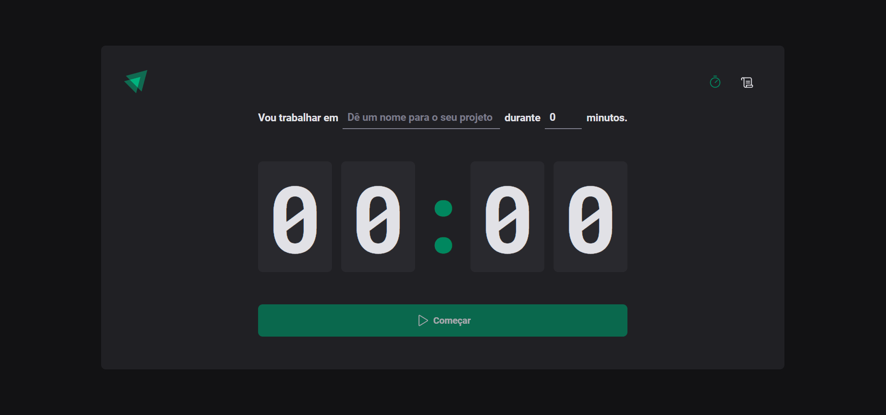
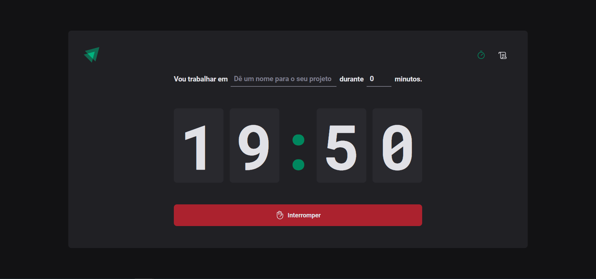
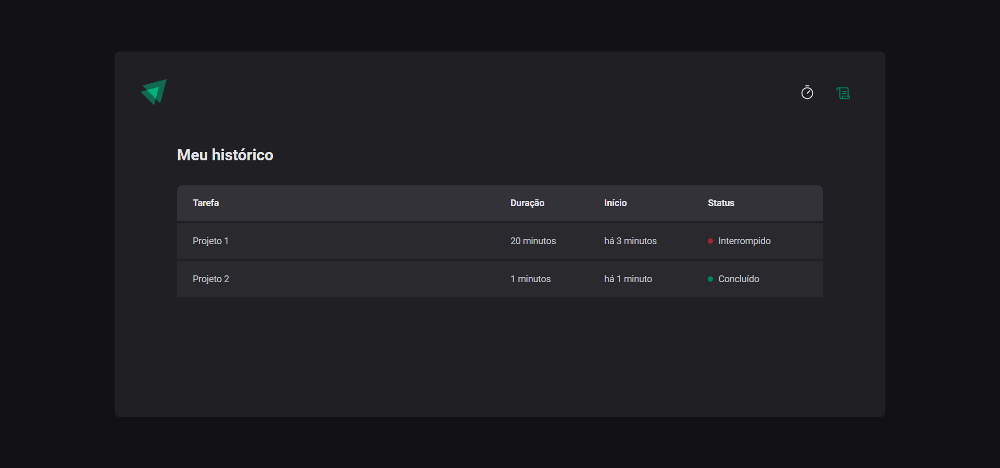

<h1 align="center">
  
</h1>

<h3 align="center">
  Projeto 02: Ignite Timer
</h3>

<blockquote align="center">“Não deixe o tempo controlar você, controle o seu tempo.”</blockquote>

  

  

## :rocket: Sobre o projeto

- Uma aplicação baseada na técnica Pomodoro, um método de gerenciamento de tempo.

## :mortar_board: Ignite - Projeto 02

### Ferramentas, tecnologias e conceitos utilizados:

- [React](https://react.dev) - Projeto iniciado com [Vite](https://vitejs.dev)
- [Typescript](https://www.typescriptlang.org)
- [EditorConfig](https://editorconfig.org) e [ESLint](https://eslint.org)
- [Immer](https://github.com/immerjs/immer) - Biblioteca para manipular imutalidade no estado da aplicação
- [Styled Components](https://styled-components.com) - Biblioteca para estilização de componentes
- [Phosphor Icons](https://phosphoricons.com)
- [Date-fns](https://date-fns.org) - Biblioteca para manipulação de data e hora
- [React Hook Form](https://react-hook-form.com)
- [Zod](https://zod.dev) - Biblioteca para validação de campos em formulários

### Funcionalidades:

- Adicionar um novo projeto com tempo determinado;
- Iniciar contagem regressiva no tempo do projeto;
- Interromper projeto;
- Visualizar histórico de projetos;

## :computer: Resultado do projeto

### Página inicial para criar e iniciar um projeto:

### Página do projeto iniciado com opção de interromper:

### Página do histórico de projetos:

---

Projeto realizado por <strong>Alley M. Carvalho</strong>

[Rocketseat](https://www.rocketseat.com.br): Ignite - ReactJS - Projeto 02
